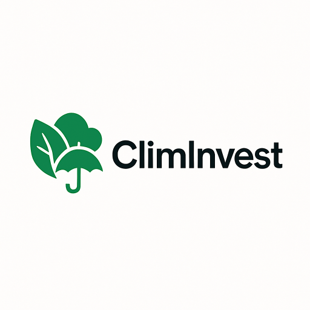

# ClimInvest - Micro-Assurance Climatique par SMS

<div align="center">
  

  ## Révolutionner l'Assurance Agricole en Afrique de l'Ouest
</div>

[](https://developer.openepi.io/hackathon-2025)
[](https://sdgs.un.org/goals/goal2)
[](https://reactnative.dev/)
[](https://openepi.io/)

## Aperçu du Projet

ClimInvest est une application mobile révolutionnaire qui démocratise l'accès à l'assurance agricole en Afrique de l'Ouest. Utilisant une approche mobile-first avec intégration SMS et appels téléphoniques, l'application offre une micro-assurance climatique accessible à tous les agriculteurs, même ceux sans smartphone.

## 🎥 Démonstration Vidéo

<div align="center">
  <video width="600" controls>
    <source src="https://res.cloudinary.com/dtwx8br7o/video/upload/v1753450192/2025-07-25_14-23-56_xv9mqb.mp4" type="video/mp4">
    Votre navigateur ne supporte pas la lecture vidéo.
  </video>
</div>

> **Découvrez ClimInvest en action** : souscription par SMS, déclenchement automatique des indemnisations, onglet Analyses avec scoring de crédit, et toutes les fonctionnalités d'accessibilité.

*[Cliquez sur la vidéo pour voir la démonstration complète de l'application]*

### Problématique Adressée

- **97% des agriculteurs africains non-assurés** vs 50% en Asie
- **0.7% des primes d'assurance mondiale** pour 17% des terres arables
- **Délais d'indemnisation: 3-6 mois** avec l'assurance traditionnelle
- **Barrières d'accès**: coûts prohibitifs, complexité administrative, faible bancarisation

### Solution Innovante

Micro-assurance **100% mobile** utilisant:
- **Appel au 980** - Conseillers guidant le processus complet
- **SMS "MON ASSURANCE AGRICOLE" au 980** - Souscription par SMS simple
- **APIs OpenEPI avancées** - Données climatiques, sol, rendements en temps réel
- **Mobile Money** - MTN MoMo, Orange Money, Flooz
- **Interface vocale** - Langues locales (fon, yoruba, bambara)
- **Communauté** - Un utilisateur peut aider toute sa communauté agricole

## Fonctionnalités d'Accessibilité

### Options d'Accès Multiple

1. **Application Mobile** (Android/iOS)
   - Interface complète avec toutes les fonctionnalités
   - Support des lecteurs d'écran
   - Navigation vocale en langues locales
   - Intégration complète des APIs OpenEPI

2. **Accès par Téléphone (980)**
   - **Pour les utilisateurs sans smartphone Android**
   - Conseillers guidant le processus de souscription
   - Même processus pour les demandes de prêt
   - Support multilingue
   - Accès aux mêmes données OpenEPI via conseillers

3. **SMS Simple au 980**
   - Envoyer **"MON ASSURANCE AGRICOLE"** au 980
   - Processus guidé par SMS
   - Confirmation et suivi par SMS
   - Accessible sur tous les téléphones

4. **Système Communautaire**
   - Un agriculteur avec l'application peut aider sa communauté
   - Inscription collective facilitée
   - Partage d'informations climatiques OpenEPI

### Transparence des Données

L'onglet **Analyses** fournit des services avancés basés sur les retours utilisateurs :
- **Score de crédit agricole** basé sur données OpenEPI (sol, climat, rendements)
- **Accès au financement** avec montants éligibles et taux personnalisés
- **Analyses agricoles** : qualité du sol, rendements historiques, prix du marché
- **Conseils personnalisés** pour optimiser production et ventes

## Intégration OpenEPI - Cœur du Système

### APIs OpenEPI Utilisées

1. **Climate Data API**
   - Données météorologiques historiques et temps réel
   - Indices de sécheresse et de précipitations
   - Déclenchement automatique des indemnisations

2. **Soil Quality API**
   - Analyse de la qualité des sols
   - Recommandations agricoles personnalisées
   - Scoring de crédit basé sur la qualité du sol

3. **Crop Health Monitoring**
   - Surveillance satellite des cultures
   - Détection précoce des stress hydriques
   - Alertes proactives aux agriculteurs

4. **Flood Detection API**
   - Détection d'inondations en temps réel
   - Cartographie des zones affectées
   - Déclenchement automatique des compensations

### Avantages de l'Intégration OpenEPI

- **Données fiables et actualisées** en temps réel
- **Couverture géographique complète** de l'Afrique de l'Ouest
- **Algorithmes de détection avancés** pour les événements climatiques
- **Intégration transparente** avec les systèmes de paiement mobile
- **Réduction des coûts** grâce à l'automatisation

## Avantages Compétitifs vs Assurance Traditionnelle

| **Critère** | **Clim-Invest** | **Assurance Classique** |
|-------------|-----------------|-------------------------|
| **Coût mensuel** | 200-1 000 FCFA | 5 000-20 000 FCFA |
| **Délai d'indemnisation** | 24-72h automatique | 3-6 mois (expertise) |
| **Accessibilité** | Mobile money + analphabètes | Bureau + compte bancaire |
| **Couverture géographique** | Zones reculées via satellite | Centres urbains uniquement |
| **Prérequis** | Téléphone basique | Smartphone + internet |

## Fondations Technologiques Éprouvées

Les données satellites sont accessibles via Digital Earth Africa, qui fournit des images historiques depuis 1984 couvrant tout le continent africain. Le système NDVI permet de détecter le stress des cultures jusqu'à **2 semaines avant détection visuelle**, tandis que Sentinel-1 offre une précision **>95% pour la détection d'inondations**.

Les infrastructures AGRHYMET garantissent l'accès aux données météorologiques en temps réel pour les 15 pays de la CEDEAO, avec des stations météo automatisées et des modèles de prévision saisonnière Next Generation.

## Modèle Économique Durable

- **80%** des primes → Fonds d'indemnisation
- **15%** → Coûts techniques (données, SMS, plateforme)
- **5%** → Croissance et réserves

**Seuil de rentabilité** : 50,000 assurés avec un fonds de réserve gouvernemental de 10% des primes pour les catastrophes majeures.

## Enseignements Internationaux

**Kenya (Kilimo Salama)** : Lancé en 2009 avec 200 agriculteurs, le programme a atteint 51,000 assurés au Kenya et 14,000 au Rwanda. Les revenus de primes sont passés de 19 millions KSh en 2011 à 33 millions KSh en 6 mois en 2012.

**Inde (PMFBY)** : Le programme gouvernemental couvre 194 millions d'agriculteurs avec des subventions de 50% des primes. Les primes varient de 1,5% à 5% des sommes assurées selon les cultures.

Ces succès démontrent la viabilité de l'assurance indicielle à grande échelle avec un soutien public approprié.

## Impact Projeté

- **500,000 agriculteurs** protégés d'ici 2027
- **2.5 millions de personnes** sécurisées (familles incluses)
- **Indemnisation 45x plus rapide** (24-72h vs 3-6 mois)
- **Coût 10x inférieur** à l'assurance traditionnelle
- **Couverture géographique étendue** grâce aux données OpenEPI

## Contribution aux SDG

- **SDG 2**: Éliminer la faim - Sécurité alimentaire
- **SDG 1**: Réduction de la pauvreté rurale
- **SDG 13**: Action climatique - Résilience aux chocs
- **SDG 10**: Réduction des inégalités - Accès démocratisé

## Installation et Démarrage

### Prérequis

```bash
Node.js >= 18
npm ou yarn
Expo CLI
Android Studio (pour émulation Android)
Xcode (pour émulation iOS, macOS uniquement)
Clés API OpenEPI (requises)
```

### Installation

```bash
# Cloner le repository
git clone https://github.com/votre-username/clim-invest
cd clim-invest

# Installer les dépendances
npm install

# Configurer les clés OpenEPI dans .env
cp .env.example .env
# Ajouter vos clés OpenEPI

# Démarrer le serveur de développement
npm start

# Lancer sur Android
npm run android

# Lancer sur iOS
npm run ios
```

### Configuration OpenEPI

```bash
# Variables d'environnement requises
OPENEPI_API_KEY=your_api_key_here
OPENEPI_BASE_URL=https://api.openepi.io/v1
OPENEPI_CLIENT_ID=your_client_id
OPENEPI_CLIENT_SECRET=your_client_secret
```

## Structure du Projet

```
ClimInvest/
├── src/
│   ├── components/          # Composants réutilisables
│   │   ├── common/         # Composants accessibles
│   │   ├── cards/          # Cartes d'information
│   │   └── dashboard/      # Composants tableau de bord
│   ├── screens/            # Écrans principaux
│   ├── navigation/         # Configuration navigation
│   ├── services/           # APIs OpenEPI et autres services
│   │   ├── openEpiService.ts        # Service OpenEPI principal
│   │   ├── hybridOpenEpiService.ts  # Service hybride avec fallback
│   │   └── creditScoringService.ts  # Scoring basé sur OpenEPI
│   ├── store/              # Redux store et slices
│   ├── types/              # Types TypeScript
│   ├── utils/              # Utilitaires
│   └── hooks/              # Hooks personnalisés
├── docs/                   # Documentation technique
└── assets/                 # Ressources statiques
```

## Documentation Complète

- [Architecture Technique](docs/TECHNICAL_ARCHITECTURE.md)
- [Intégration OpenEPI](docs/DATA_SOURCES.md)
- [Documentation API](docs/API_DOCUMENTATION.md)
- [Modèle Économique](docs/BUSINESS_MODEL.md)
- [Métriques d'Impact](docs/IMPACT_METRICS.md)
- [Guide de Déploiement](docs/DEPLOYMENT_GUIDE.md)
- [Retours Utilisateurs](docs/USER_FEEDBACK.md)

## Tests et Qualité

```bash
# Lancer les tests
npm test

# Tests avec couverture
npm run test:coverage

# Tests d'intégration OpenEPI
npm run test:openepi

# Linting
npm run lint
```

## Contact et Support

### Pour les Agriculteurs
- **Téléphone**: 980 (gratuit)
- **SMS**: Envoyer "MON ASSURANCE AGRICOLE" au 980
- **Application**: Télécharger sur Google Play Store

### Pour les Développeurs
- **Équipe ClimInvest** - contact@climinvest.org
- **Documentation OpenEPI** - [https://developer.openepi.io](https://developer.openepi.io)
- **Repository** - [https://github.com/climinvest/mobile-app](https://github.com/climinvest/mobile-app)

## Licence

Ce projet est sous licence MIT. Voir le fichier `LICENSE` pour plus de détails.

---

*Développé pour OpenEPI Hackathon 2025 - Révolutionner l'agriculture africaine par les données climatiques*
