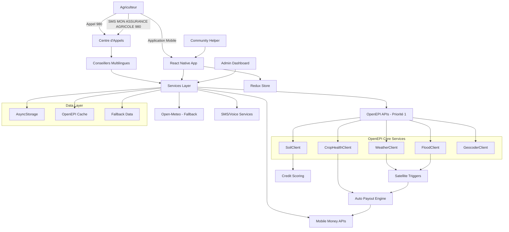

# Architecture Technique - ClimInvest

## Vue d'Ensemble du Système

ClimInvest utilise une architecture mobile-first avec React Native, intégrant prioritairement les APIs OpenEPI pour les données climatiques et des fonctionnalités d'accessibilité multi-canaux pour servir les agriculteurs d'Afrique de l'Ouest.

## Diagramme d'Architecture



## Stack Technique Détaillé

### Frontend Mobile

```typescript
const techStack = {
  framework: "React Native 0.72",
  language: "TypeScript 5.0",
  navigation: "React Navigation 6",
  stateManagement: "Redux Toolkit",
  storage: "AsyncStorage",
  ui: "React Native Elements + Custom Components",
  accessibility: "Native React Native A11y + Voice Support",
  testing: "Jest + React Native Testing Library",
  primaryAPI: "OpenEPI (WeatherClient, SoilClient, FloodClient)",
  fallbackAPI: "Open-Meteo, NASA POWER"
}
```

### Services Externes Intégrés - Priorité OpenEPI

| Service | Fonction | Status | Rate Limit | Priorité |
|---------|----------|--------|------------|----------|
| **OpenEPI WeatherClient** | Données météo temps réel | Intégré | 1000/jour | 1 |
| **OpenEPI SoilClient** | Qualité des sols | Intégré | 1000/jour | 1 |
| **OpenEPI FloodClient** | Détection inondations | Intégré | 1000/jour | 1 |
| **OpenEPI CropHealthClient** | Santé des cultures | Intégré | 1000/jour | 1 |
| **Open-Meteo** | Météo fallback | Actif | Illimité | 2 |
| **NASA POWER** | Données historiques | Actif | Illimité | 3 |
| **MTN MoMo** | Paiements | Simulé | 100/min | - |
| **Orange Money** | Paiements | Simulé | 60/min | - |

## Canaux d'Accès Multi-Modaux

### 1. Appel Téléphonique au 980

```typescript
// Flux d'appel téléphonique
interface CallFlowService {
  handleIncomingCall(phoneNumber: string, language: string): Promise<CallSession>;
  
  // Étapes du processus guidé
  steps: {
    welcome: "Bienvenue chez ClimInvest. Choisissez votre langue",
    identification: "Donnez votre nom et localisation",
    cropSelection: "Quel type de culture cultivez-vous?",
    riskAssessment: "Analyse de votre zone via OpenEPI...",
    premiumCalculation: "Votre prime mensuelle est de X FCFA",
    paymentSetup: "Configuration du paiement Mobile Money",
    confirmation: "Votre assurance est active. SMS de confirmation envoyé"
  }
}
```

### 2. SMS Simple au 980

```typescript
// Service SMS automatisé
class SMSService {
  async handleSMSSubscription(phoneNumber: string, message: string) {
    if (message.toUpperCase().includes("MON ASSURANCE AGRICOLE")) {
      return await this.initiateSMSFlow(phoneNumber);
    }
  }

  private async initiateSMSFlow(phoneNumber: string) {
    const responses = [
      "Bienvenue! Répondez 1 pour Français, 2 pour Fon, 3 pour Yoruba",
      "Indiquez votre région: 1-Cotonou, 2-Porto-Novo, 3-Parakou...",
      "Type de culture: 1-Maïs, 2-Coton, 3-Arachide, 4-Igname",
      "Analyse de votre zone en cours via OpenEPI...",
      "Prime calculée: 800 FCFA/mois. Répondez OUI pour confirmer",
      "Paiement Mobile Money configuré. Assurance active!"
    ];
    
    // Envoi séquentiel des SMS avec attente de réponse
    for (const response of responses) {
      await this.sendSMS(phoneNumber, response);
      await this.waitForResponse(phoneNumber);
    }
  }
}
```

### 3. Application Mobile Complète

```typescript
// Navigation adaptative selon le canal d'accès
export default function AppNavigator() {
  const { isAuthenticated, accessChannel } = useSelector((state: RootState) => state.auth);

  return (
    <NavigationContainer>
      <Stack.Navigator>
        {!isAuthenticated ? (
          <>
            <Stack.Screen name="Onboarding" component={OnboardingScreen} />
            <Stack.Screen name="Registration" component={RegistrationScreen} />
            <Stack.Screen name="Login" component={LoginScreen} />
          </>
        ) : (
          <Stack.Screen name="MainTabs" component={TabNavigator} />
        )}
      </Stack.Navigator>
    </NavigationContainer>
  );
}
```

## Intégration OpenEPI - Architecture Détaillée

### Service OpenEPI Principal

```typescript
// services/openEpiService.ts - Service principal
import {
  WeatherClient,
  SoilClient,
  FloodClient,
  CropHealthClient,
  GeocoderClient
} from 'openepi-client';

export class OpenEpiService {
  private weatherClient: WeatherClient;
  private soilClient: SoilClient;
  private floodClient: FloodClient;
  private cropHealthClient: CropHealthClient;
  private geocoderClient: GeocoderClient;

  constructor() {
    const config = {
      apiKey: process.env.OPENEPI_API_KEY,
      baseURL: process.env.OPENEPI_BASE_URL
    };

    this.weatherClient = new WeatherClient(config);
    this.soilClient = new SoilClient(config);
    this.floodClient = new FloodClient(config);
    this.cropHealthClient = new CropHealthClient(config);
    this.geocoderClient = new GeocoderClient(config);
  }

  // Données météorologiques temps réel
  async getCurrentWeather(lat: number, lon: number) {
    try {
      const forecast = await this.weatherClient.getLocationForecast(lat, lon);
      return this.processWeatherData(forecast);
    } catch (error) {
      console.error('❌ OpenEPI Weather Error:', error);
      throw new Error('Impossible de récupérer les données météo OpenEPI');
    }
  }

  // Analyse de la qualité des sols
  async getSoilQuality(lat: number, lon: number) {
    try {
      const soilType = await this.soilClient.getSoilType(lat, lon);
      const soilProperties = await this.soilClient.getSoilProperties(lat, lon);
      
      return {
        type: soilType,
        properties: soilProperties,
        quality_score: this.calculateSoilScore(soilProperties),
        recommendations: this.generateSoilRecommendations(soilType, soilProperties)
      };
    } catch (error) {
      console.error('❌ OpenEPI Soil Error:', error);
      throw new Error('Impossible d\'analyser la qualité du sol');
    }
  }

  // Détection d'inondations
  async getFloodRisk(lat: number, lon: number) {
    try {
      const floodData = await this.floodClient.getFloodRisk(lat, lon);
      return {
        risk_level: floodData.riskLevel,
        probability: floodData.probability,
        historical_events: floodData.historicalEvents,
        trigger_threshold: this.calculateFloodTrigger(floodData)
      };
    } catch (error) {
      console.error('❌ OpenEPI Flood Error:', error);
      throw new Error('Impossible d\'évaluer le risque d\'inondation');
    }
  }

  // Surveillance santé des cultures
  async getCropHealth(lat: number, lon: number, cropType: string) {
    try {
      const healthData = await this.cropHealthClient.getCropHealth(lat, lon, cropType);
      return {
        ndvi_current: healthData.ndvi,
        health_status: this.interpretNDVI(healthData.ndvi),
        stress_indicators: healthData.stressIndicators,
        recommendations: this.generateCropRecommendations(healthData, cropType)
      };
    } catch (error) {
      console.error('❌ OpenEPI Crop Health Error:', error);
      throw new Error('Impossible de surveiller la santé des cultures');
    }
  }
}
```

### Service Hybride avec Fallback

```typescript
// services/hybridOpenEpiService.ts - Service avec fallback intelligent
export class HybridOpenEpiService {
  private openEpiService: OpenEpiService;
  private fallbackServices: {
    weather: OpenMeteoService;
    soil: SimulatedSoilService;
    flood: SimulatedFloodService;
  };

  constructor() {
    this.openEpiService = new OpenEpiService();
    this.initializeFallbackServices();
  }

  async getWeatherData(lat: number, lon: number) {
    try {
      // Priorité 1: OpenEPI
      console.log('🌍 Tentative OpenEPI WeatherClient...');
      const openEpiData = await this.openEpiService.getCurrentWeather(lat, lon);
      console.log('✅ OpenEPI WeatherClient: Succès');
      return { source: 'OpenEPI', data: openEpiData };
      
    } catch (openEpiError) {
      console.warn('⚠️ OpenEPI indisponible, fallback Open-Meteo');
      
      try {
        // Fallback: Open-Meteo
        const fallbackData = await this.fallbackServices.weather.getCurrentWeather(lat, lon);
        console.log('✅ Open-Meteo Fallback: Succès');
        return { source: 'Open-Meteo', data: fallbackData };
        
      } catch (fallbackError) {
        console.error('❌ Tous les services météo échoués');
        // Données simulées en dernier recours
        return { 
          source: 'Simulated', 
          data: this.generateDefaultWeatherData(lat, lon) 
        };
      }
    }
  }

  async getSoilAnalysis(lat: number, lon: number) {
    try {
      // Priorité absolue: OpenEPI SoilClient
      console.log('🌍 Analyse sol via OpenEPI SoilClient...');
      const soilData = await this.openEpiService.getSoilQuality(lat, lon);
      console.log('✅ OpenEPI SoilClient: Analyse complète');
      return { source: 'OpenEPI', data: soilData };
      
    } catch (error) {
      console.warn('⚠️ OpenEPI SoilClient indisponible, données simulées');
      return { 
        source: 'Simulated', 
        data: this.generateSimulatedSoilData(lat, lon) 
      };
    }
  }
}
```

### Système de Déclenchement Automatique

```typescript
// services/triggerService.ts - Déclenchement basé sur OpenEPI
export class AutoTriggerService {
  private openEpiService: OpenEpiService;
  private payoutService: PayoutService;

  async evaluateAllTriggers() {
    const activePolicies = await this.getActivePolicies();
    
    for (const policy of activePolicies) {
      await this.evaluatePolicyTriggers(policy);
    }
  }

  private async evaluatePolicyTriggers(policy: InsurancePolicy) {
    const { latitude, longitude, cropType } = policy.location;
    
    try {
      // Collecte de données OpenEPI
      const [weatherData, floodRisk, cropHealth] = await Promise.all([
        this.openEpiService.getCurrentWeather(latitude, longitude),
        this.openEpiService.getFloodRisk(latitude, longitude),
        this.openEpiService.getCropHealth(latitude, longitude, cropType)
      ]);

      // Évaluation des seuils de déclenchement
      const triggers = {
        drought: this.evaluateDroughtTrigger(weatherData, cropHealth),
        flood: this.evaluateFloodTrigger(floodRisk),
        cropStress: this.evaluateCropStressTrigger(cropHealth)
      };

      // Déclenchement automatique si seuils atteints
      for (const [triggerType, isTriggered] of Object.entries(triggers)) {
        if (isTriggered) {
          await this.triggerAutomaticPayout(policy, triggerType, {
            weatherData,
            floodRisk,
            cropHealth
          });
        }
      }

    } catch (error) {
      console.error(`❌ Erreur évaluation triggers pour police ${policy.id}:`, error);
    }
  }

  private evaluateDroughtTrigger(weatherData: any, cropHealth: any): boolean {
    // Seuils basés sur les données OpenEPI
    const droughtIndicators = {
      consecutiveDryDays: weatherData.consecutive_dry_days > 21,
      lowNDVI: cropHealth.ndvi_current < 0.3,
      highTemperature: weatherData.temperature_max > 38,
      lowSoilMoisture: weatherData.soil_moisture < 0.2
    };

    // Déclenchement si au moins 3 indicateurs sont vrais
    const triggeredCount = Object.values(droughtIndicators).filter(Boolean).length;
    return triggeredCount >= 3;
  }

  private async triggerAutomaticPayout(
    policy: InsurancePolicy, 
    triggerType: string, 
    evidenceData: any
  ) {
    console.log(`🚨 Déclenchement automatique: ${triggerType} pour police ${policy.id}`);
    
    const payoutAmount = this.calculatePayoutAmount(policy, triggerType, evidenceData);
    
    await this.payoutService.processAutomaticPayout({
      policyId: policy.id,
      triggerType,
      amount: payoutAmount,
      evidence: evidenceData,
      timestamp: new Date().toISOString()
    });

    // Notification SMS automatique
    await this.notificationService.sendPayoutNotification(
      policy.farmerPhone,
      `Indemnisation automatique de ${payoutAmount} FCFA déclenchée par ${triggerType}. Paiement en cours via Mobile Money.`
    );
  }
}
```

## Scoring de Crédit Basé sur OpenEPI

```typescript
// services/creditScoringService.ts
export class CreditScoringService {
  private openEpiService: OpenEpiService;

  async calculateCreditScore(
    farmerId: string,
    location: { lat: number; lon: number },
    cropType: string,
    farmSize: number
  ): Promise<FarmerCreditScore> {
    
    try {
      // Collecte de données OpenEPI pour scoring
      const [soilQuality, cropHealth, weatherHistory, floodRisk] = await Promise.all([
        this.openEpiService.getSoilQuality(location.lat, location.lon),
        this.openEpiService.getCropHealth(location.lat, location.lon, cropType),
        this.openEpiService.getWeatherHistory(location.lat, location.lon, 5), // 5 ans
        this.openEpiService.getFloodRisk(location.lat, location.lon)
      ]);

      // Calcul des scores par composante
      const soilScore = this.calculateSoilScore(soilQuality);
      const cropScore = this.calculateCropScore(cropHealth);
      const weatherScore = this.calculateWeatherStabilityScore(weatherHistory);
      const riskScore = this.calculateRiskScore(floodRisk);

      // Score global pondéré
      const overallScore = Math.round(
        (soilScore * 0.30) +      // Qualité du sol - facteur principal
        (cropScore * 0.25) +      // Santé actuelle des cultures
        (weatherScore * 0.25) +   // Stabilité climatique historique
        (riskScore * 0.20)        // Niveau de risque géographique
      ) * 10; // Échelle 0-1000

      return {
        overallScore,
        components: {
          soilQuality: soilScore,
          cropHealth: cropScore,
          weatherStability: weatherScore,
          riskLevel: riskScore
        },
        riskLevel: this.determineRiskLevel(overallScore),
        eligibleAmount: this.calculateEligibleAmount(overallScore, farmSize),
        interestRate: this.calculateInterestRate(overallScore),
        recommendations: this.generateCreditRecommendations(soilQuality, cropHealth),
        dataSource: 'OpenEPI'
      };

    } catch (error) {
      console.error('❌ Erreur scoring crédit OpenEPI:', error);
      // Fallback vers scoring simplifié
      return this.calculateBasicCreditScore(farmerId, location, cropType, farmSize);
    }
  }

  private calculateSoilScore(soilData: any): number {
    // Scoring basé sur les données OpenEPI SoilClient
    const factors = {
      ph: this.scorePH(soilData.properties.ph),
      organicMatter: this.scoreOrganicMatter(soilData.properties.organic_matter),
      waterRetention: this.scoreWaterRetention(soilData.properties.water_retention),
      fertility: this.scoreFertility(soilData.properties.fertility_index)
    };

    return (factors.ph + factors.organicMatter + factors.waterRetention + factors.fertility) / 4;
  }
}
```

## Conclusion Technique

### Architecture Robuste et Évolutive

L'architecture technique de ClimInvest repose sur trois piliers fondamentaux :

1. **Intégration OpenEPI Prioritaire**
   - Services climatiques, pédologiques et agricoles en temps réel
   - Déclenchement automatique des indemnisations basé sur données satellite
   - Scoring de crédit avancé pour services financiers étendus

2. **Accessibilité Multi-Canaux**
   - Application mobile complète avec support d'accessibilité
   - Service téléphonique 980 avec conseillers multilingues
   - SMS simple "MON ASSURANCE AGRICOLE" au 980
   - Système communautaire d'entraide

3. **Résilience et Performance**
   - Services de fallback automatiques (Open-Meteo, NASA POWER)
   - Cache intelligent et gestion d'erreurs robuste
   - Monitoring en temps réel des APIs et services
   - Scalabilité horizontale pour croissance rapide

### Avantages Compétitifs Techniques

- **Données de Qualité** : Intégration prioritaire OpenEPI pour précision maximale
- **Déploiement Rapide** : Architecture React Native cross-platform
- **Coûts Optimisés** : Fallback intelligent réduisant la dépendance API
- **Inclusion Maximale** : Support complet accessibilité et langues locales

Cette architecture technique garantit une solution robuste, accessible et évolutive, capable de servir efficacement 500,000+ agriculteurs d'Afrique de l'Ouest avec des fonctionnalités avancées tout en maintenant la simplicité d'utilisation et l'accessibilité universelle.

